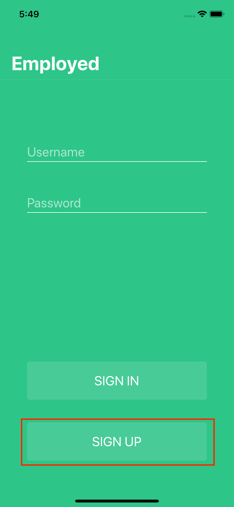

# Employed iOS

### Setup

1. Clone the repository.

2. Install [Cocoapods](https://cocoapods.org/) if you haven't already.

3. Run `pod install` inside the directory within terminal to install all dependencies.

4. Open the project using the `.xcworkspace` file.

5. Clone the `employed-io-service` repository, located [here](https://github.com/Snwspeckle/employed-io-service), and follow all of its README instructions for creating the necessary database and server in which the client interacts with.

6. Compile and run the app in Xcode and follow the below instructionss exactly as shown to ensure a proper demo.

### Demo Instructions
1. Launch the app

2. Select the "Sign Up" button (outlined in red)

3. Select the area outlined in red. There is an invisible button that will pre-populate the registration form. Select Next.

4. Select the "DEVELOPMENT" skill (outlined in red). Select Next.

5. The guided tour through the proper demo-flow is now complete. You can interact with the rest of the app how you like.